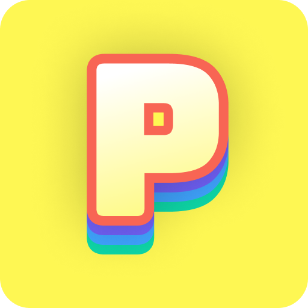

    
    <h1 align="center">Puskázz App</h1>
    
<i>Puskázz, mint egy profi!</i>

## Mi az a Puskázz App?

A Puskázz App segítséget nyújt az iskolai domdozatok megírása közben. Az alkalmazás könnyen kezelhető felületet biztosít, amely lehetővé teszi a gyors és hatékony puskázását. Az applikáció kiemelkedő tulajdonsága, hogy alapértelmezetten egy sötét képernyő fogad az adott puska betöltése után, mintha a telefon kikapcsolt állapotban lenne. A puskát (legyen az szöveges vagy kép alapú) csak akkor jeleníti meg, ha az ujjaddal lenyomva tartod a képernyőt. Ha észreveszed, hogy a tanár figyel, vagy csak el szeretned rejteni a puskát, elengedheted a képernyőt, és a telefon ismét "kikapcsolt" állapotot imitál.
   
A Puskázz App elérhető Android (APK) és iOS (TestFlight) eszközökre egyaránt, és folyamatos fejlesztésekkel és újdonságokkal várja felhasználóit. 

## Letöltések

    
    

## Contributing

A Puskázz App mostmár nyílt forráskódú, így akár te is hozzájárulhatsz az app fejlesztéséhez.
Mielőtt hozzájárlnál, olvasd el a [CONTRIBUTING.md](CONTRIBUTING.md)-t

Mindenfajta hozzájárulást szívesen látunk!
**Főbb feladatok**:
- Kód optimalizálása, átlálhatóvá tétele (clean code)
- Helyesírási hibák kijavítása (ha vannak)
- Wiki / dokumentáció írás